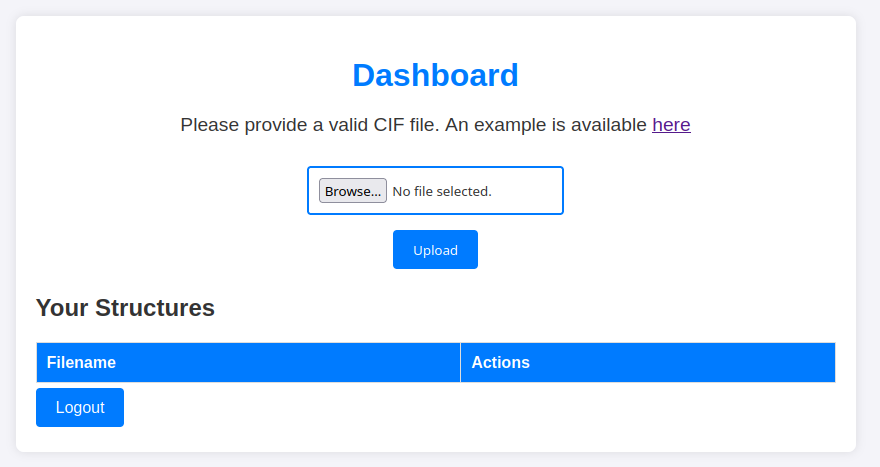
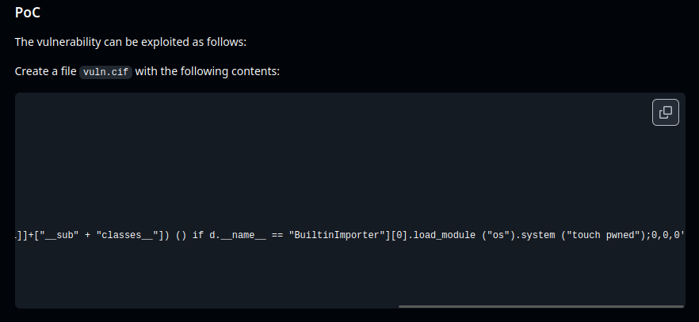
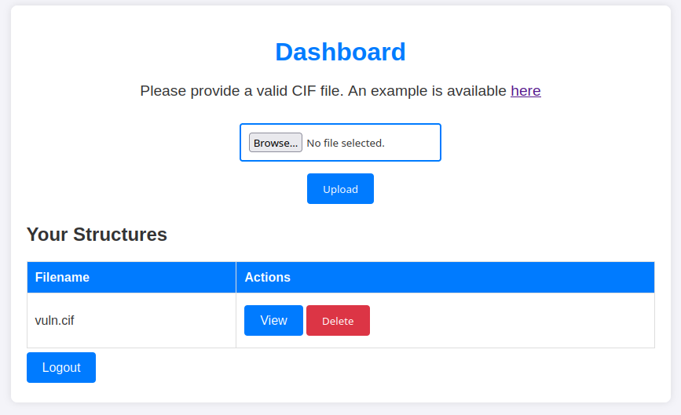
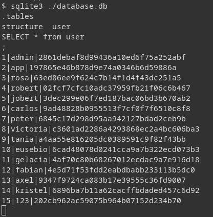
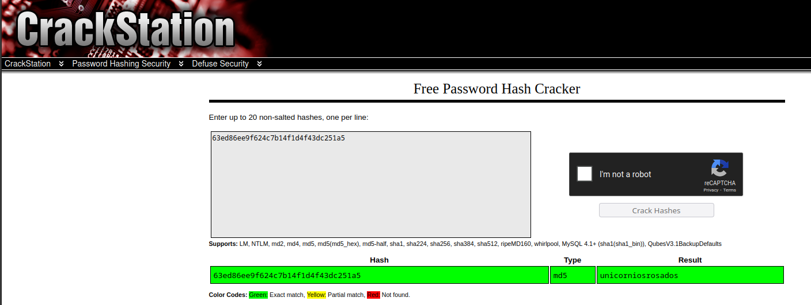
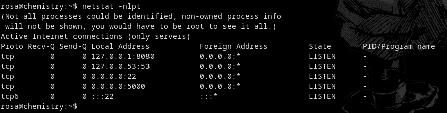
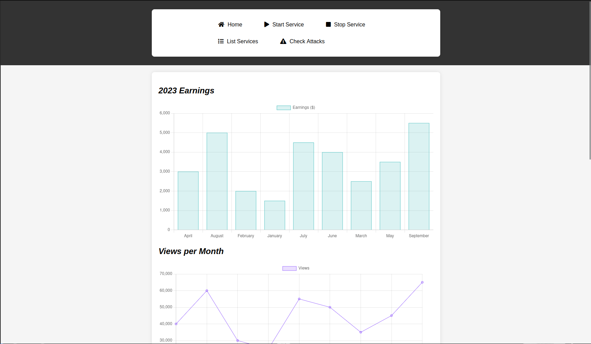
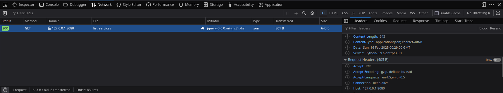
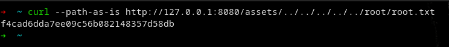

## Enumeração

Comecei utilizando o nmap para descobrir quais serviços estavam ativos em quais portas, fiz portanto um scan TCP através do comando `nmap -Pn -T5 10.10.11.38` e consigo encontrar os serviços ssh na porta 22 TCP e http na porta 5555 TCP

![nmap][imagens/nmap.png]

Acessando a página, encontrei uma página de upload de arquivos de extensão CIF, da qual nunca tinha ouvido falar, baixei o exemplo de arquivo, e procurei na internet exploits relacionados a esse tipo de arquivo

Procurando online por exploits, encontrei um [Github](https://github.com/materialsproject/pymatgen/security/advisories/GHSA-vgv8-5cpj-qj2f) com uma vulnerabilidade em arquivos CIF

Com esse arquivo CIF, mudei o comando de touch para uma reverse shell para a minha máquina e fiz upload no site

Após isso, dei o comando `nc -vnlp 4444` e cliquei em "View", assim obtive a shell. No sistema, procurando por arquivos, encontrei uma base de dados chamada database.db no diretório /home/app/instance, então dei o comando `sqlite3 ./database.db` e encontrei os hashes dos usuários

Para descriptografar entro no site https://crackstation.net/ e inseri hash de senha do admin, porém não consigo encontrar, nem utilizando o John, por isso, tento do usuário rosa, que já havia visto anteriormente na aplicação e consigo sua senha, unicorniosrosados

Depois de conseguir a senha, loguei pelo serviço SSH utilizando as credenciais obtidas anteriormente, e dando um simples ls, consigo a user key

## Privilege Escalation

Com o usuário Rosa, dou um `netstat -nlpt` e vejo que existe um serviço na porta 8080 que não conseguia acessar por fora

 
 Por isso uso o comando `ssh -L 8080:127.0.0.1:8080 rosa@10.10.11.38` para fazer um port forward para a minha porta 8080, acessando a página, encontro um monitor

Olhando os headers da página com o console, vejo que se trata de um aiohttp 3.9.1

Procurando por vulnerabilidades desse serviço, encontro esse [Github](https://github.com/z3rObyte/CVE-2024-23334-PoC/tree/main) vejo que ele apenas da o comando `curl --path-as-is http:site.com/static/../../../../../etc/passwd`, porém para o meu caso, como sabia que a flag do HackTheBox sempre se chama root.txt, já utilizei o comando `curl --path-as-is http://127.0.0.1:8080/assets/../../../../../root/root.txt` e assim consigo a key

