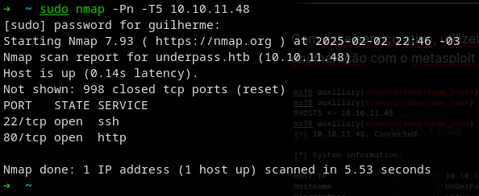
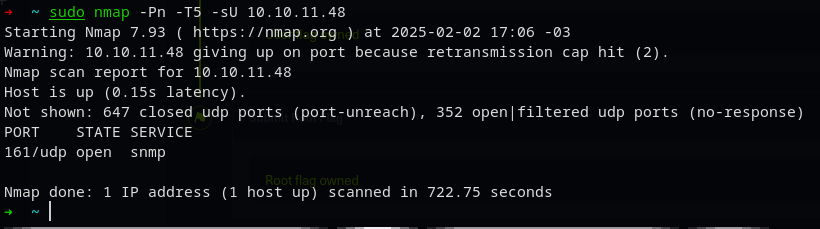
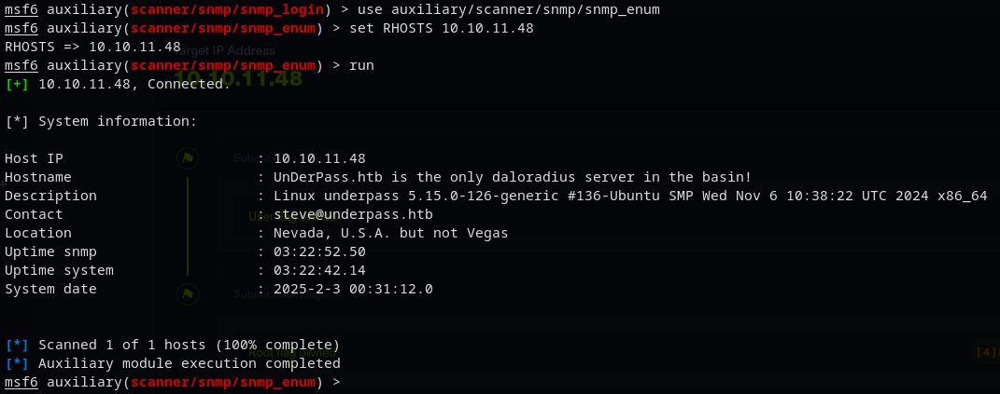
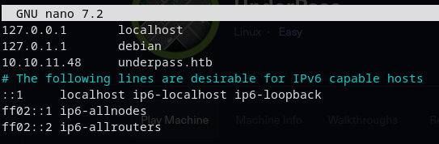
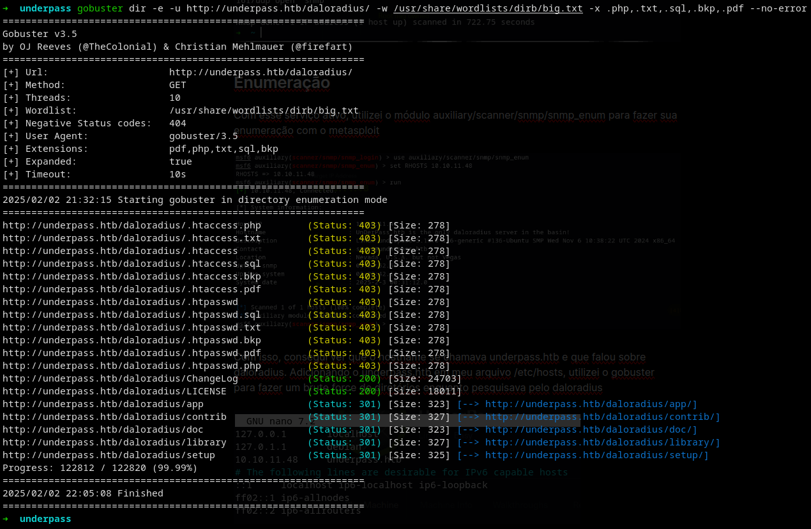
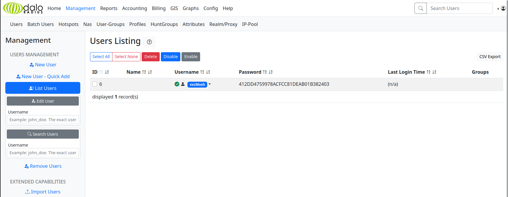
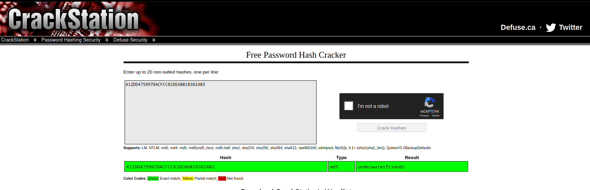
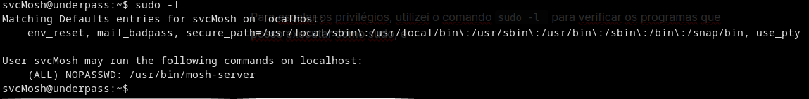
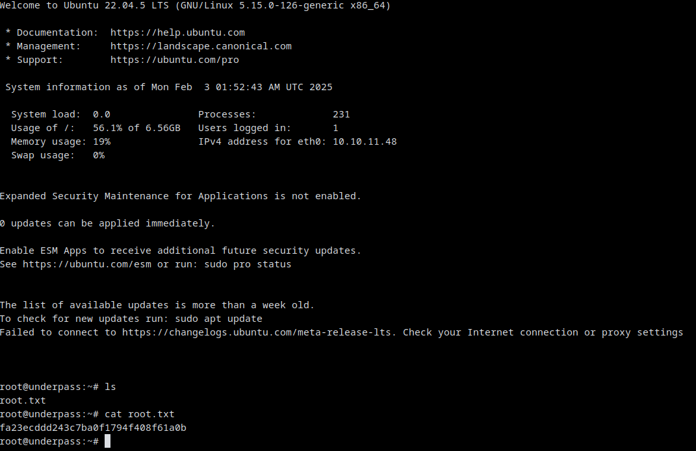

## Enumeração

Comecei utilizando o nmap para descobrir quais serviços estavam ativos em quais portas, fiz portanto um scan TCP e UDP, através do comando `sudo nmap -Pn -T5 -sU 10.10.11.48` e `sudo nmap -Pn -T5 10.10.11.48` e consigo encontrar os serviços ssh na porta 22 TCP, http na porta 80 TCP e por fim snmp na porta 161 UDP

Com esse serviço ativo, utilizei o módulo auxiliary/scanner/snmp/snmp_enum para fazer sua enumeração com o metasploit

Com isso, consegui ver que o hostname se chamava underpass.htb e que falou sobre daloradius. Adicionando o underpass.htb em meu arquivo /etc/hosts, utilizei o gobuster para fazer um brute force de diretórios enquanto pesquisava pelo daloradius

Pesquisando sobre o daloradius encontrei do que se tratava, um sistema de gerenciamento de rede, portanto dei fuzzing nesse diretório online através do comando `gobuster dir -e -u http://underpass.htb/deloradius/ -w /usr/share/wordlists/dirb/big.txt -x .php,.txt,.sql,.bkp,.pdf --no-error` para ver se encontrava alguma coisa

Ampliando o fuzzy para dentro do diretório app, encontro o diretório /app/operators. Entrando no site http://underpass.htb/daloradius/app/operators, tento utilizar as credenciais padrões do daloradius, administrador:radius, e consigo logar. Acessando os usuários, vejo que existe o usuário svcMosh, porém sua senha está criptografada

Para descriptografar entro no site https://crackstation.net/ e insiro o hash de senha, lá então consigo a senha do usuário, underwaterfriends

Depois de conseguir a senha, loguei pelo serviço SSH utilizando as credenciais obtidas anteriormente, svcMosh:underwaterfriends, e dando um simples ls, consigo a user key: 318e3379c1865605a000a4c6fa5ad3d4

## Privilege Escalation

Para escalar os privilégios, utilizei o comando `sudo -l ` para verificar os programas que posso executar como sudo e vi que posso utilizar o mosh-server como sudo

Pesquisando a respeito do mash-server, achei como escalar privilégios através do comando `mosh --server="sudo /usr/bin/mosh-server" localhost`, depois disso dei um ls, e encontrei a root key: fa23ecddd243c7ba0f1794f408f61a0b

